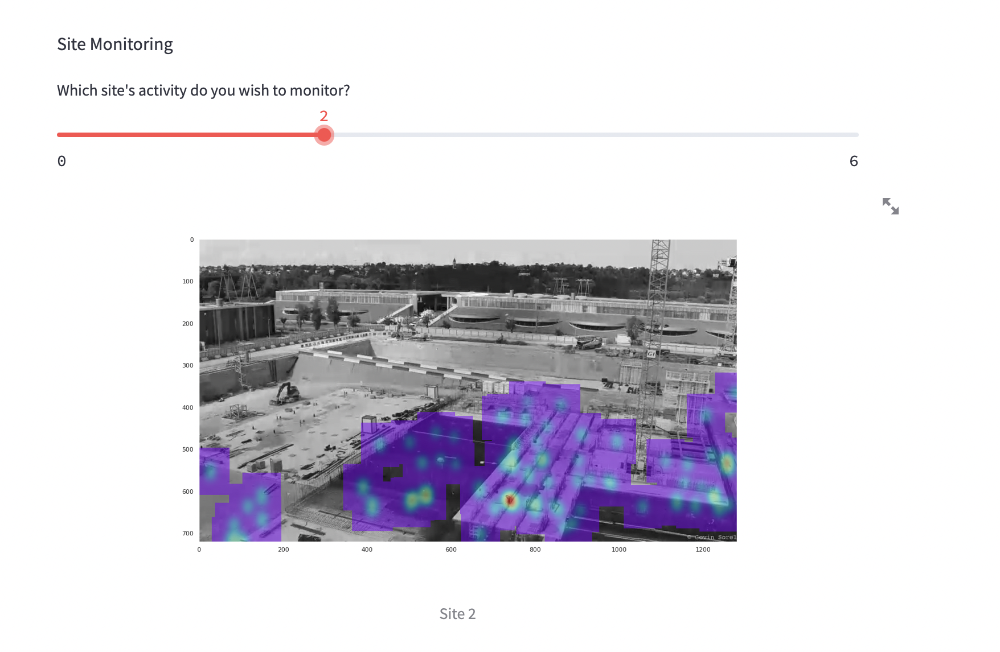
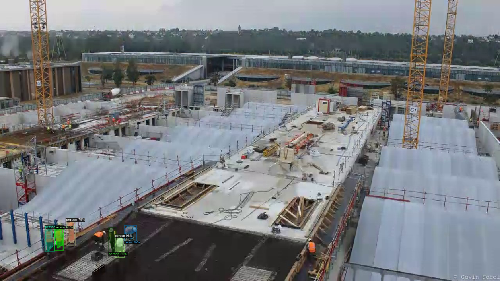

# Eleven Strategy Hackathon - Worksite Monitoring 

&nbsp;

  

- **Duration:** 1 week.
- **Group Size:** 4.
- **Project Description:** A Hackathon organized by Eleven Strategy to ensure worksite safety by "utilizing Computer Vision technology". We were asked to develop a convolutional model to detect workers on worksites and use it to produce an on-site security protocol.
- **Final Result:** We used worksite annotated images to train Facebook's Detectron2 and YOLOv5. The models were transfer learned and produced extremely satisfying results in practice. We then created an API on Streamlit that would identify workers in real-time by processing on-site security camera images. Alerts would be sent when workers were detected in an unsual zone of the worksite.
- **Ranking:** 2nd Place.

---

- **Files Description:**
    - **[Detectron Model -](https://github.com/EdouardVilain-Git/EdouardVilain-M2-DSBA/blob/main/1.%20Company%20Projects%20and%20Challenges/Eleven%20Strategy%20Hackathon/Detectron2.ipynb)** The notebook used to transfer learn the Detectron2 model.
    - **[YOLOv5 Model -](https://github.com/EdouardVilain-Git/EdouardVilain-M2-DSBA/blob/main/1.%20Company%20Projects%20and%20Challenges/Eleven%20Strategy%20Hackathon/YOLOv5s.ipynb)** The notebook used to transfer learn the YOLOv5 model.

 

  <b>Real Time Work Site Monitoring API (Streamlit)</b>
  

  <b>YOLOv5 Worker Detection Prediction</b>
  

