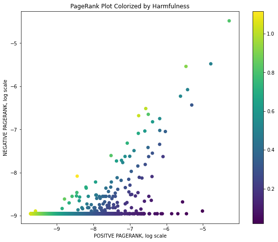

# Machine Learning in Network Sciences - Moderating Subreddits using Hyperlink Networks 

  

- **Duration:** 2 weeks.
- **Group Size:** 2.
- **Project Description:** This project is an extension of [Community Interaction and Conflict on the Web](https://cs.stanford.edu/~srijan/pubs/conflict-paper-www18.pdf). It aimed to design an automatic moderation technique for harmful Subreddits. Based on historical Subreddit interaction data, we studied their behaviours using **a graph based approach**. While predicting interactions between Reddit groups, we identified potentially harmful ones to focus on for increased moderation.
- **Final Result:** Using a dynamic graph based approach, we were able to predict with good precision the positive and negative interactions of Subreddits from one year to another. This required to build yearly graph structures and extract induced historical features from Subreddits and between Subreddits. We then implemented **a Deep Learning based link prediction model** to predict positive and negative interactions. Based on these predictions we defined a heuristic $harmfulness$ coefficient able to identify relatively harmful Subreddits of the coming year.
- **Grade:** TBD.

---

- **Files Description:**
    - **[Final Presentation -](https://github.com/EdouardVilain-Git/EdouardVilain-M2-DSBA/blob/main/2.%20Course%20Final%20Projects/Moderating%20Subreddits%20using%20Hyperlink%20Networks/Final%20Presentation.pdf)** Project's final presentation.
    - **[Project Code -](https://github.com/EdouardVilain-Git/EdouardVilain-M2-DSBA/blob/main/2.%20Course%20Final%20Projects/Moderating%20Subreddits%20using%20Hyperlink%20Networks/Project_Code.ipynb)** Notebook containing all the research pipeline. 

 

  <b>Subreddits Projected in the Predicted PageRank Plane - Colored by Harmfulness</b>
  

