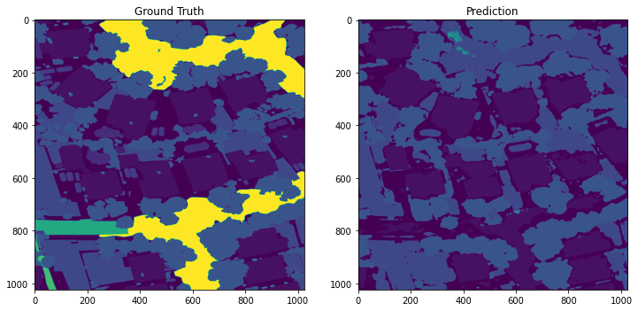

# Fundamentals of Deep Learning - Segmenting UAV Images of Flooded Residential Areas 

  

- **Duration:** 1 month.
- **Group Size:** 3.
- **Project Description:** A Kaggle competition which aimed to segment images of flooded residential areas around Houston. Practically, this would have several applications including efficient support deployment or damage reporting. The problem was formulated as multi-class classification and models were evaluated using a macro-F1 score. Data included 261 images and their associated annotated mask.
- **Final Result:** Using **Pytorch**, we implemented a **U-Net** model from scratch which was trained on an augmented version of the described dataset. **Augmentation methods** included rotation, distortion and cropping. Our **U-Net** architecture was optimized according to our available computational resource: as U-Nets are generally resource intensive, we had to restrict the depth of the network and of its convolutional components. In fine, we obtained a test F1-score of 68.7\% on a classification problem of 25 classes. Transfer trained models outperformed us by a margin, as it was possible to train larger architectures with already performing models. 
- **Grade:** 16/20. 

---

- **Files Description:**
    - **[Final Report -](https://github.com/EdouardVilain-Git/EdouardVilain-M2-DSBA/blob/main/2.%20Course%20Final%20Projects/Segmenting%20UAV%20Images%20of%20Flooded%20Residential%20Areas/Report.pdf)** Project's final report.
    - **[Project Code -](https://github.com/EdouardVilain-Git/EdouardVilain-M2-DSBA/blob/main/2.%20Course%20Final%20Projects/Segmenting%20UAV%20Images%20of%20Flooded%20Residential%20Areas/Project_Code.ipynb)** Notebook containing all the research pipeline.

 

  <b>Multi-Class Segmentation of a Test UAV Image</b>
  

