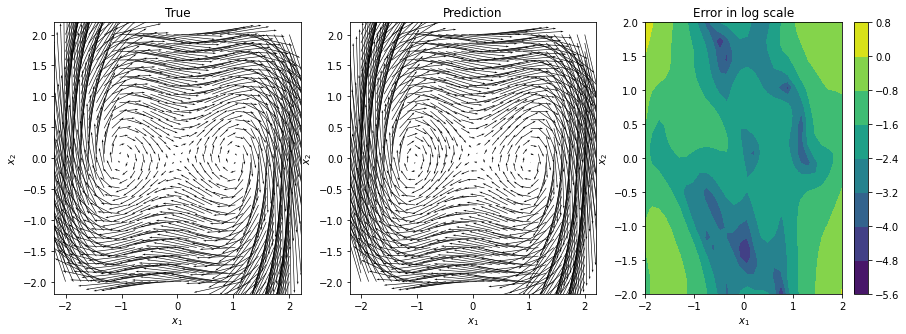

# Advanced Deep Learning 

  

 - **Course Duration:** 3 months.
 - **Group Size:** 2.
 - **Assignments:**
    1. **Multiclass Classification -** Simple handwritten digits classification with Convolution Neural Networks on the [USPS dataset](https://www.csie.ntu.edu.tw/~cjlin/libsvmtools/datasets/multiclass/usps.bz2). Extensive model architecture and hyper-parameter tuning.
    2. **Regression -** Simple Regression task with Dense Neural Networks on a house pricing task. Extensive model architecture and hyper-parameter tuning.
    3. **Gradcam-** Implementation of the Grad-Cam algorithm using Pytorch forward and backward hooks. Application to the pre-trained ResNet-18 architecture and a dataset of animal images.
    4. **Graph Neural Networks -** Building Graph Neural Networks [Graph Convolutional](https://docs.dgl.ai/generated/dgl.nn.pytorch.conv.GraphConv.html) and [Graph Attention Convolutional layers](https://docs.dgl.ai/generated/dgl.nn.pytorch.conv.GATConv.html). Application to a classification task on the [Legacy PPI Dataset](https://docs.dgl.ai/en/0.6.x/_modules/dgl/data/ppi.html).
    5. **Transfer Learning -** Implementation and comparison of transfer learning methods on a classification task of the [CIFAR10 dataset](https://www.cs.toronto.edu/~kriz/cifar.html) using the ResNet18 architecture. Training model from scratch. Using a pre-trained version of the model and training its final layer. Augmenting the CIFAR10 dataset by using a set of geometric transformations. Hyper-parameter tuning.
    6.  **[Koopman Decomposition applied to the Duffing Oscillator](https://nicholasgeneva.com/deep-learning/koopman/dynamics/2020/05/30/intro-to-koopman.html) -** Implementation of the Encoder-Processor-Decoder architecture of **the Koopman Module**. Solving the Duffing Oscillator in discrete time using the Koopman Module. Implementation of the Encoder-Processor-Decoder architecture of **the Lie Module**. Solving the Duffing Oscillator in continuous time using the Lie Module.
    7.  **Generative Models -** Implementation of three different generative models to sample data from the [moons distribution](https://scikit-learn.org/stable/modules/generated/sklearn.datasets.make_moons.html): Generative Adversarial Networks (GANs), Variational AutoEncoders (VAEs) and Normalizing Flows.
- **Grade:** TBD.

---

- **Files Description:**
    - **[Classification -](https://github.com/EdouardVilain-Git/EdouardVilain-M2-DSBA/blob/main/3.%20Course%20Assignments/Advanced%20Deep%20Learning/classification.ipynb)** Code of the classification tasks.
    - **[GradCam -](https://github.com/EdouardVilain-Git/EdouardVilain-M2-DSBA/blob/main/3.%20Course%20Assignments/Advanced%20Deep%20Learning/gradcam.ipynb)** GradCam implementation.
    - **[Koopman and Lie Modules -](https://github.com/EdouardVilain-Git/EdouardVilain-M2-DSBA/blob/main/3.%20Course%20Assignments/Advanced%20Deep%20Learning/koopman.ipynb)** Implementation and application of the Koopman and Lie Modules.
    - **[Generative Models -](https://github.com/EdouardVilain-Git/EdouardVilain-M2-DSBA/blob/main/3.%20Course%20Assignments/Advanced%20Deep%20Learning/generative.ipynb)** Generative models code.

 

  <b>Koopman Module Prediction on the Duffing Oscillator</b>

    

