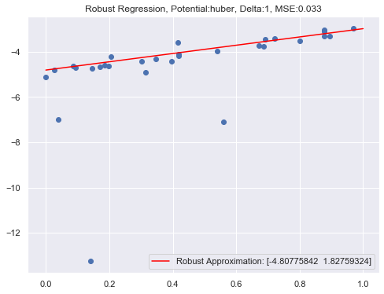
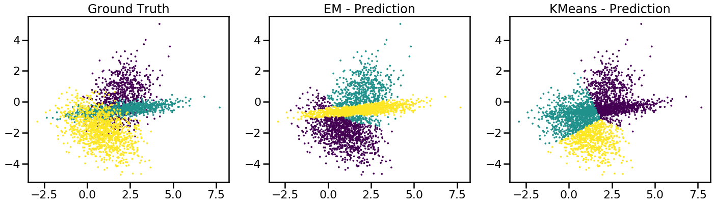

# Advanced Machine Learning 

  

- **Course Duration:** 3 months.
- **Group Size:** 1.
- **Assignments:**
    1. **Clustering -** Implementation of Agglomerative Single Linkage Clustering. Comparison to other linkage methods (ward, complete, average) and clustering algorithms (k-means, DBSCAN, HDBSCAN). Application to image segmentation and compression.
    2. **Regression -** Implementation of Ridge, Lasso and Robust Regression. Application to time series prediction (bycicles traffic).
    3. **Stochastic Gradient Descent -** Implementation of Logistic Regression. Implementation of the Stochastic Gradient Descent algorithm in the case of Logistic Regression and with several optimizers (Vanilla, Adagrad, RMSProp, Momentum and ADAM). Application to the [w8a dataset](https://www.openml.org/search?type=data&sort=runs&id=1588&status=active), comparison of optimizer performance and hyper-parameter tuning.
    4. **Non-Negative Matrix Factorization -** Implementation of an NMF algorithm. Appplication to the Olivetti Faces Dataset and finding the best factorization dimension. Application to topic modelization of the 20 new groups text dataset.
    5. **Gaussian Mixture Models & Model Order Selection-** Implementation of a Gaussian Mixture Model class and the associated EM (Expectation-Maximization) training algorithm. Application to handwritten digits generation using the [MNIST dataset](http://yann.lecun.com/exdb/mnist/) reduced in lower dimension.
- **Grade:** 16/20.

---

- **Files Description:**
    - **[Clustering -](https://github.com/EdouardVilain-Git/EdouardVilain-M2-DSBA/blob/main/3.%20Course%20Assignments/Advanced%20Machine%20Learning/clustering.ipynb)** Implementation of clustering algorithms.
    - **[Stochastic Gradient Descent -](https://github.com/EdouardVilain-Git/EdouardVilain-M2-DSBA/blob/main/3.%20Course%20Assignments/Advanced%20Machine%20Learning/sgd.ipynb)** Stochastic Gradient Descent implementation and optimizer comparison.
    - **[Gaussian Mixture Models & Model Order Selection-](https://github.com/EdouardVilain-Git/EdouardVilain-M2-DSBA/blob/main/3.%20Course%20Assignments/Advanced%20Machine%20Learning/gaussianmixtures.ipynb)** Gaussian Mixture Models implementation and applications.

 

  <b>Comparison of K-Means and Gaussian Mixtures</b>

    

