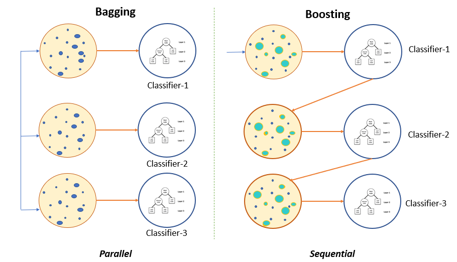

# Ensemble Learning 

  

 - **Course Duration:** 2 months.
 - **Group Size:** 4.
 - **Assignments:**
    1. **Decision Trees -** Implemented our own Object Oriented version of Decision Trees. Compared to sklearn in both classification and regression tasks. Our method performed with better precision on both cases but was much more computationally heavy (10 times the run time on simple cases). While sklearn creates splits using tree depth-search, our method analyzed all split possibilities at each iteration.
    2. **Cyberbullying Classification of Tweets -** Classification of annotated tweets into 8 cyberbullying categories. Feature engineering of tweets including Stemming, Lemmatisation, stop-word removal and TF-IDF vectorization. Also simple tweet features such as length, characters, hashtags, retweets and presence of swear-words. Application of ensemble models to the classification task: Random Forests, XGBoost, CatBoost...
 - **Grade -** TBD.

---

- **Files Description:**
    - **[Decision Tree -](https://github.com/EdouardVilain-Git/EdouardVilain-M2-DSBA/blob/main/3.%20Course%20Assignments/Ensemble%20Learning/decision_tree.ipynb)** Decision trees implementation and comparison with sklearn.
    - **[Cyberbullying Classification of Tweets -](https://github.com/EdouardVilain-Git/EdouardVilain-M2-DSBA/blob/main/3.%20Course%20Assignments/Ensemble%20Learning/tweet_analysis.ipynb)** Code for tweet sentiment analysis classification.

 

  <b>Comparison of K-Means and Gaussian Mixtures</b>

    

