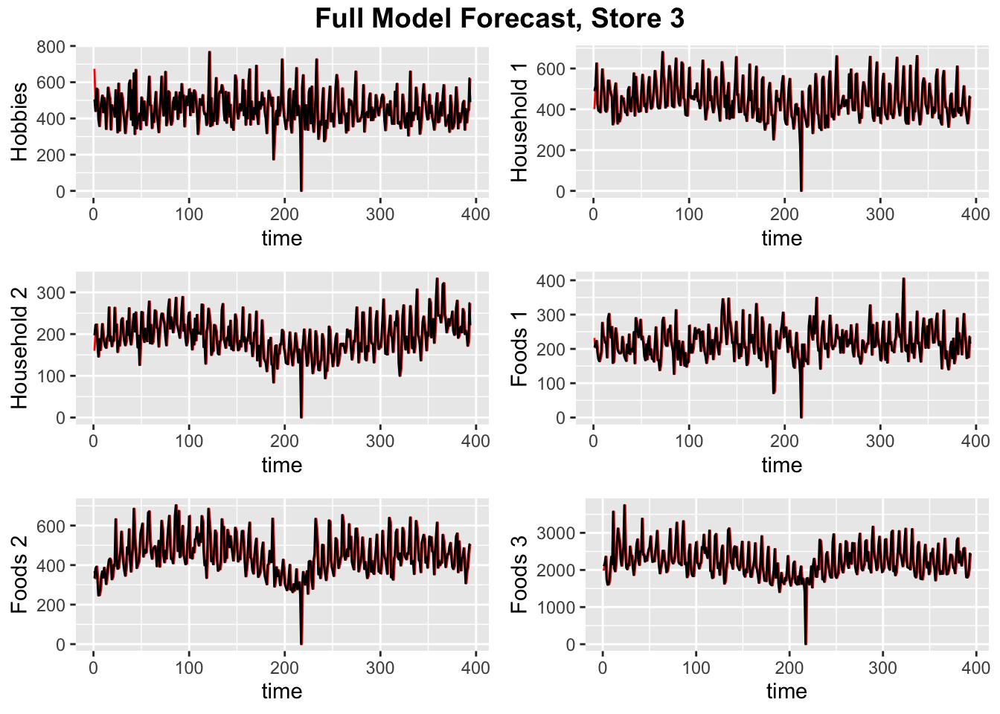

# Forecasting & Predictive Analytics
 **Keywords:** Forecasting, Python, R

  

 - **Course Duration:** 3 months.
 - **Group Size:** 3.
 - **Assignment:**
    1. **Forecasting Walmart Sales -** A reproduction of the [M5 Competition](https://mofc.unic.ac.cy/m5-competition/) for Walmart sales forecasting. Fitting Univariate Naive, ES, MA, SARIMA, SARIMAX, State-Space and probabilistic models. Fitting Multivariate VAR models and Machine/Deep Learning models. Predicting with variable horizon sizes and comparing results with competition leaderboard.
 - **Grade:** 16/20.

---

- **Files Description:**
    - **[Univariate Forecasting -](https://github.com/EdouardVilain-Git/EdouardVilain-M2-DSBA/blob/main/3.%20Course%20Assignments/Forecasting%20%26%20Predictive%20Analytics/univariate.html)** Code for univariate forecasting.
    - **[Multivariate Forecasting -](https://github.com/EdouardVilain-Git/EdouardVilain-M2-DSBA/blob/main/3.%20Course%20Assignments/Forecasting%20%26%20Predictive%20Analytics/multivariate.html)** Code for multivariate forecasting.
    - **[ML/DL Forecasting -](https://github.com/EdouardVilain-Git/EdouardVilain-M2-DSBA/blob/main/3.%20Course%20Assignments/Forecasting%20%26%20Predictive%20Analytics/ml.ipynb)** Code for ML/DL forecasting.

 

  <b>Forecasted vs Real Product Sales - Multivariate Model</b>

    

