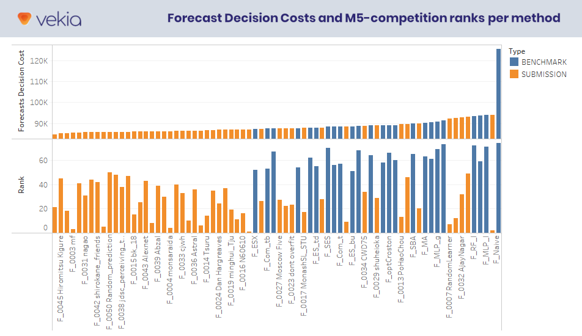

# Forecasting & Predictive Analytics
 **Keywords:** Forecasting, Python, R

  

 - **Course Duration:** 3 months.
 - **Group Size:** 3.
 - **Assignment:**
    1. **Forecasting Walmart Sales -** A reproduction of the [M5 Competition](https://mofc.unic.ac.cy/m5-competition/) for Walmart sales forecasting. Fitting Univariate Naive, ES, MA, SARIMA, SARIMAX, State-Space and probabilistic models. Fitting Multivariate VAR models and Machine/Deep Learning models. Predicting with variable horizon sizes and comparing results with competition leaderboard.
 - **Grade:** 16/20.