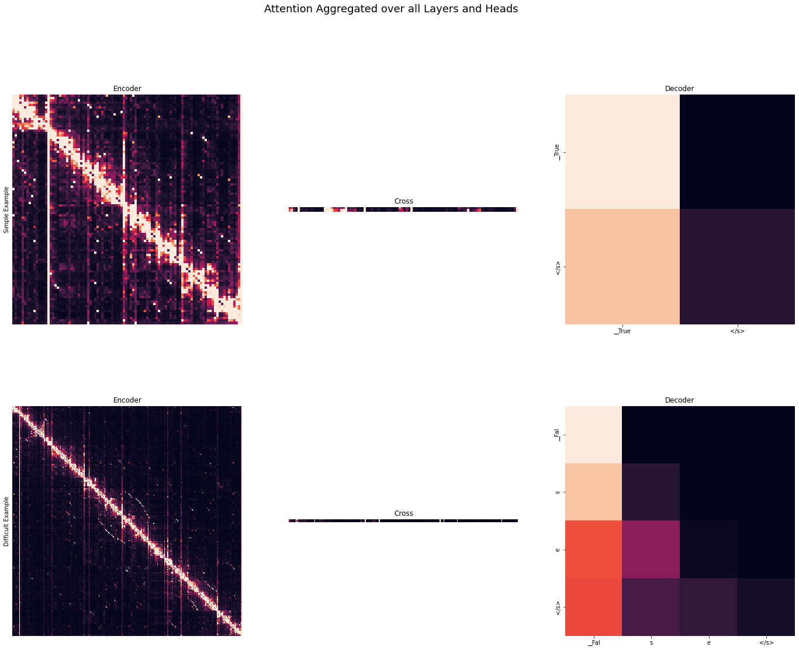

# Natural Language Processing 

  

 - **Course Duration:** 3 months.
 - **Group Size:** 2.
 - **Assignments:**
    1. **SkipGram -** Implemented the SkipGram model. Trained it on a corpus of 1 Million news articles.
    2. **T5 Model and Attention Heads -** Applied the T5 model from HuggingFace on several tasks (Translation, Summarization and Question Answering). Manually implemented [BLEU](https://aclanthology.org/P02-1040.pdf) and [ROUGE](https://aclanthology.org/W04-1013.pdf) evaluation metrics. Implemented manual token decoding methods for the T5 model. Visualized and compared attention head activation of the T5 model on several tasks (Translation, Summarization and Question Answering) and aggregated activation of the attention heads across heads and layers. Implemented the [confidence aggregation metric](https://aclanthology.org/P19-1580.pdf) to compare attention head behaviour across tasks.
 - **Grade:** TBD.

---

- **Files Description:**
    - **[SkipGram -](https://github.com/EdouardVilain-Git/EdouardVilain-M2-DSBA/blob/main/3.%20Course%20Assignments/Natural%20Language%20Processing/skipgram.py)** SkipGram implementation.
    - **[T5 & Attention Heads -](https://github.com/EdouardVilain-Git/EdouardVilain-M2-DSBA/blob/main/3.%20Course%20Assignments/Natural%20Language%20Processing/attention.ipynb)** T5 model testing and attention heads aggregation.

 

  <b>Aggregation of Attention Heads Activation over Layers - Question Answering Task</b>

    

