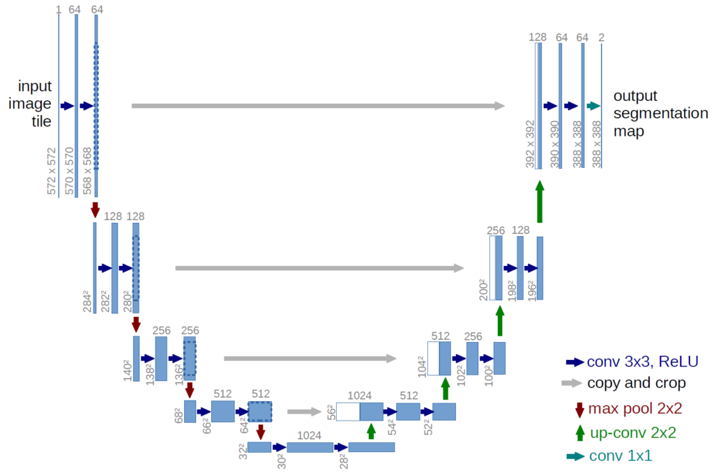

# Final Engineering Year and M2 in Data Sciences & Business Analytics
# Edouard Vilain

  

## Introduction

This repo is a collection of **the Data Science related projects of my final Master's year**. It showcases my projects across **Machine Learning and Data Science** related tasks (Querying, Engineering, Processing and Visualizing).

The aim is to summarize the work I have achieved during this final Master's year and does not aim to be copied, except for personal use. By respect for the several third party authors involved in each of the projects, I have intentionally left project files aside, so code could not be run directly from the Git. Please contact me if you wish to work on a project in particular.

## Table of Contents

1. [Company Projects and Challenges](#companyprojects)
    1. [BCG Gamma Data Challenge](#bcgchallenge)
    2. [Eleven Strategy Hackathon](#elevenhackathon)
    3. [Corporate Research Project](#crp)
2. [Course Final Projects](#courseprojects)
    1. [Moderating Subreddits using Hyperlink Networks](#subreddit)
    2. [Segmenting UAV Images of Flooded Residential Areas](#floods)
    3. [Grid Search Optimization](#gridsearch)
    4. [Targetting Donors for Charity Marketing Campaigns](#donorcampaign)
    5. [Analyzing Financial Time Series with Persistent Homology](#financecrash)
3. [Course Assignments](#assignments)
    1. [Advanced Machine Learning](#aml)
    2. [Advanced Deep Learning](#adl)
    3. [Ensemble Learning](#ensemble)
    4. [Natural Language Processing](#nlp)

## Project Summaries

Here is a short summary of the projects showcased in this repo. For technical details or an in-depth look at the related code, please take a look at the related project file.

## I- Company Projects and Challenges 

### 1. BCG Gamma Data Challenge - Predicting Parisian Road Traffic for Delivery Scheduling 

  

- **Duration:** 1 week.
- **Group Size:** 5.
- **Project Description:** A Data Challenge organized by BCG Gamma on driver delivery scheduling. We were asked for two deliverables:
  - a predictive model for Parisian traffic density using public data.
  - a strategy to organize a delivery company's driver schedule according to our model's results.
- **Final Result:** We built a simple Catboost model with heavy feature engineering. Model performed extremely well when including environmental features such as weather, temperature and covid restrictions state.
- **Ranking:** 1st Place.

### 2. Eleven Strategy Hackathon - Worksite Monitoring 

&nbsp;

  

- **Duration:** 1 week.
- **Group Size:** 4.
- **Project Description:** A Hackathon organized by Eleven Strategy to ensure worksite safety by "utilizing Computer Vision technology". We were asked to develop a convolutional model to detect workers on worksites and use it to produce an on-site security protocol.
- **Final Result:** We used worksite annotated images to train Facebook's Detectron2. The model was transfer learned and produced extremely satisfying results in practice. We then created an API on Streamlit that would identify workers in real-time by processing on-site security camera images. Alerts would be sent when workers were detected in an unsual zone of the worksite.
- **Ranking:** 2nd Place.

### 3. Corporate Research Project - Sensitive Pen for Dysgraphia Detection 

  

- **Duration:** 6 months.
- **Group Size:** 5.
- **Project Description:** A research oriented project in collaboration with a CRI (Centre de Recherche Interdisciplinaire) PhD student. Her doctorate work focuses on dysgraphia and more specifically on building scalable tools for large scale detection. Dysgraphia, which is a deficiency in the ability to write, can be healed when diagnosed early. Thus, by analyzing handwriting data and building Machine Learning models, we aimed to **predict cases of dysgraphia in children**. Though I cannot unveil the work the PhD student is currently pursuing, the data we worked with corresponds to writing recordings from patients in the form of a variable size time series signal.
- **Final Result:** Data preprocessing was the crucial part of this project. Because the recordings were incredibly noisy, we extracted their statistical properties to produce a 1-dimensional feature set rather than building LSTMs. Based on this pre-processed data, we implemented two models:
  - A Decision Tree, with the intent of having highly interpretable results. 
  - A Deep Learning approach inspired from [How to Use Convolutional Neural Networks for Time Series Classification](https://towardsdatascience.com/how-to-use-convolutional-neural-networks-for-time-series-classification-56b1b0a07a57), with the intent of having enhanced results. 
  - **Results were unsatisfying** in practice (a RMSE of 5 for a score ranging from 0 to 40) but it was understood with our collaborator that **we lacked extensively in data.** Indeed, we worked with a dataset of under 40 patients, not enough to build a generalizable model, especially on such a complex task. In any case, **the PhD student and her supervisors were extremely pleased with the results**, which showed to be promising when data would be sufficient.

## II- Course Final Projects 

### 1. Machine Learning in Network Sciences - Moderating Subreddits using Hyperlink Networks 

  

- **Duration:** 2 weeks.
- **Group Size:** 2.
- **Project Description:** This project is an extension of [Community Interaction and Conflict on the Web](https://cs.stanford.edu/~srijan/pubs/conflict-paper-www18.pdf). It aimed to design an automatic moderation technique for harmful Subreddits. Based on historical Subreddit interaction data, we studied their behaviours using **a graph based approach**. While predicting interactions between Reddit groups, we identified potentially harmful ones to focus on for increased moderation.
- **Final Result:** Using a dynamic graph based approach, we were able to predict with good precision the positive and negative interactions of Subreddits from one year to another. This required to build yearly graph structures and extract induced historical features from Subreddits and between Subreddits. We then implemented **a Deep Learning based link prediction model** to predict positive and negative interactions. Based on these predictions we defined a heuristic $harmfulness$ coefficient able to identify relatively harmful Subreddits of the coming year.
- **Grade:** TBD.

### 2. Fundamentals of Deep Learning - Segmenting UAV Images of Flooded Residential Areas 

  

- **Duration:** 1 month.
- **Group Size:** 3.
- **Project Description:** A Kaggle competition which aimed to segment images of flooded residential areas around Houston. Practically, this would have several applications including efficient support deployment or damage reporting. The problem was formulated as multi-class classification and models were evaluated using a macro-F1 score. Data included 261 images and their associated annotated mask.
- **Final Result:** Using **Pytorch**, we implemented a **U-Net** model from scratch which was trained on an augmented version of the described dataset. **Augmentation methods** included rotation, distortion and cropping. Our **U-Net** architecture was optimized according to our available computational resource: as U-Nets are generally resource intensive, we had to restrict the depth of the network and of its convolutional components. In fine, we obtained a test F1-score of 68.7\% on a classification problem of 25 classes. Transfer trained models outperformed us by a margin, as it was possible to train larger architectures with already performing models. 
- **Grade:** 16/20. 

### 3. Advanced Optimization - Grid Search Optimization 

  

- **Duration:** 2 weeks.
- **Group Size:** 3.
- **Project Description:** An open project on optimization topics. We were asked to contribute to any existing open-source project with an application in optimization algorithms. We worked on an open issue of the Gradient Free Optimizers library ([Gradient-Free-Optimizers](https://github.com/SimonBlanke/Gradient-Free-Optimizers)) of Python aiming to **implement Grid Search optimization**. Grid Search is a brute force optimization algorithm which computes the target function over a specified grid and returns the minimizing/maximizing index.
- **Final Result:** As part of an existing open-source project, we adopted the Object Oriented Approach to inherit pre-existing Parent classes. The brute implementation of Grid Search is quite simple: start at the top left of the grid and make a jump on the right at each step. We observed a major inconvenience with this method. In most cases, Grid Search is run on a finite number of steps rather than on the grid's total size. Therefore, we designed a method that would explore a larger and sparser area of the grid in a low number of steps. This method is based on the cyclic nature of $m\mathbb{Z}$ in $\frac{\mathbb{Z}}{p\mathbb{Z}}$ when $p$ and $m$ are prime. Thus, by choosing a convenient value of $m$, prime to the total grid size $p$, and searching through the grid in a $\bar{m\mathbb{Z}}$ manner, we observe sparser areas of the grid in a low amount of iterations. The cyclic nature of our search method ensures that the grid is completely covered in $p$ iterations, which ensures equal time complexity to the normal method.
- **Grade:** 19/20.

### 4. Marketing Analytics - Targetting Donors for Charity Marketing Campaigns 

- **Duration:** 1 month.
- **Group Size:** 5.
- **Project Description:** We are asked to respond to a pitch from a charity's fundraising manager. As the new year is coming up, the charity is planning newt year's 9 marketing campaigns, each with a given fixed cost ($25k) and additional variable cost (85c/sollicitation). We are asked **to design and deploy a sollicitation strategy** towards existing donors for each of the 9 campaigns. The available information is a database containing several tables, of which donation history, marketing campaign information and donor information. 
- **Final Result:** Our strategy is based on a **donation expectation model**. To do so, we to built feature sets for each donor and marketing campaign which, when concatenated together, gave a donor/campaign feature set we trained our model on. The donor feature set was computed solely on aggregated historical donor data. The campaign feature set was computed by clustering campaigns together, and aggregating historical data from campaigns within a same cluster. For each future campaign and donor, we predicted a donation amount and donation expectation which, when multiplied together, outputted a donation expectation. We also computed a predicted number of donations per donor which, given the responsiveness of the donor in the past, led to an ideal number of sollicitations. The decision of sollicitating a donor for a given campaign was then based on the result of the two previous models: 
    1. a donor should only be sollicitated for a campaign if his/her donation expectation is higher than the sollicitation cost.
    2. a donor should not be sollicitated more than his/her ideal number of sollicitations. In the case he could donate in more campaigns, only select the ones with the best donation expectation.
- **Grade:** 18/20 (9/10 on managerial insights, 9/10 on analytics).

### 5. Topological Methods for Data Analysis - Analyzing Financial Time Series with Persistent Homology 

  

- **Duration:** 2 weeks.
- **Group Size:** 2.
- **Project Description:** The goal of this project was to **analyze the evolution of daily returns of four major US stock market indices** over the period 1989-2016 using persistent homology. This project was an extension of [Topological Data Analysis of Financial Time Series: Landscapes of Crashes](https://arxiv.org/pdf/1703.04385.pdf) whose focus was to prove TDA (Topological Data Analysis) would bring **new analysis methods for early market crash detection**. We aimed to reproduce their analysis with our own implementation of persistence landscapes (compare to Gudhi library of Python) and further improve their results. 
- **Final Result:** First, we implemented an Object Oriented version of Persistence Landscapes (representation of a topological dataset's Rips Filtration in a Banach Space, see [1](https://arxiv.org/pdf/1703.04385.pdf) for further details).  We compared our implementation to the existing Gudhi library, which is state-of-the-art, and proved our implementation is better by a margin in terms of both correctness and time complexity. Second, we developped the paper's analysis by reimplementing their method and adding additional arguments to support their claim. As they mention, TDA seems to be an efficient method to detect market crashes early. Indeed, the latter show brutal intakes in variance and spectral density of the $L^1$ and $L^2$ norms of their persistence landscapes prior to both the Dotcom Crash and the Lehmann Bankruptcy. Moreover, **we have shown that using variable window sizes and higher order norms for the topological analysis enable earlier detection of major stock market crashes**. Though a compromise must be found between precision and computational constraints, the choice of a higher window size and higher degree norms is advised.
- **Grade:** 15/20.

## III- Course Assignments 

### 1. Advanced Machine Learning 

- **Course Duration:** 3 months.
- **Group Size:** 1.
- **Assignments:**
    1. **Clustering -** Implementation of Agglomerative Single Linkage Clustering. Comparison to other linkage methods (ward, complete, average) and clustering algorithms (k-means, DBSCAN, HDBSCAN). Application to image segmentation and compression.
    2. **Regression -** Implementation of Ridge, Lasso and Robust Regression. Application to time series prediction (bycicles traffic).
    3. **Stochastic Gradient Descent -** Implementation of Logistic Regression. Implementation of the Stochastic Gradient Descent algorithm in the case of Logistic Regression and with several optimizers (Vanilla, Adagrad, RMSProp, Momentum and ADAM). Application to the [w8a dataset](https://www.openml.org/search?type=data&sort=runs&id=1588&status=active), comparison of optimizer performance and hyper-parameter tuning.
    4. **Non-Negative Matrix Factorization -** Implementation of an NMF algorithm. Appplication to the Olivetti Faces Dataset and finding the best factorization dimension. Application to topic modelization of the 20 new groups text dataset.
    5. **Gaussian Mixture Models & Model Order Selection-** Implementation of a Gaussian Mixture Model class and the associated EM (Expectation-Maximization) training algorithm. Application to handwritten digits generation using the [MNIST dataset](http://yann.lecun.com/exdb/mnist/) reduced in lower dimension.
- **Grade:** 16/20.

### 2. Advanced Deep Learning 

 - **Course Duration:** 3 months.
 - **Group Size:** 2.
 - **Assignments:**
    1. **Multiclass Classification -** Simple handwritten digits classification with Convolution Neural Networks on the [USPS dataset](https://www.csie.ntu.edu.tw/~cjlin/libsvmtools/datasets/multiclass/usps.bz2). Extensive model architecture and hyper-parameter tuning.
    2. **Regression -** Simple Regression task with Dense Neural Networks on a house pricing task. Extensive model architecture and hyper-parameter tuning.
    3. **Gradcam-** Implementation of the Grad-Cam algorithm using Pytorch forward and backward hooks. Application to the pre-trained ResNet-18 architecture and a dataset of animal images.
    4. **Graph Neural Networks -** Building Graph Neural Networks [Graph Convolutional](https://docs.dgl.ai/generated/dgl.nn.pytorch.conv.GraphConv.html) and [Graph Attention Convolutional layers](https://docs.dgl.ai/generated/dgl.nn.pytorch.conv.GATConv.html). Application to a classification task on the [Legacy PPI Dataset](https://docs.dgl.ai/en/0.6.x/_modules/dgl/data/ppi.html).
    5. **Transfer Learning -** Implementation and comparison of transfer learning methods on a classification task of the [CIFAR10 dataset](https://www.cs.toronto.edu/~kriz/cifar.html) using the ResNet18 architecture. Training model from scratch. Using a pre-trained version of the model and training its final layer. Augmenting the CIFAR10 dataset by using a set of geometric transformations. Hyper-parameter tuning.
    6.  **[Koopman Decomposition applied to the Duffing Oscillator](https://nicholasgeneva.com/deep-learning/koopman/dynamics/2020/05/30/intro-to-koopman.html) -** Implementation of the Encoder-Processor-Decoder architecture of **the Koopman Module**. Solving the Duffing Oscillator in discrete time using the Koopman Module. Implementation of the Encoder-Processor-Decoder architecture of **the Lie Module**. Solving the Duffing Oscillator in continuous time using the Lie Module.
    7.  **Generative Models -** Implementation of three different generative models to sample data from the [moons distribution](https://scikit-learn.org/stable/modules/generated/sklearn.datasets.make_moons.html): Generative Adversarial Networks (GANs), Variational AutoEncoders (VAEs) and Normalizing Flows.
- **Grade:** TBD.

### 3. Ensemble Learning 

 - **Course Duration:** 2 months.
 - **Group Size:** 4.
 - **Assignments:**
    1. **Decision Trees -** Implemented our own Object Oriented version of Decision Trees. Compared to sklearn in both classification and regression tasks. Our method performed with better precision on both cases but was much more computationally heavy (10 times the run time on simple cases). While sklearn creates splits using tree depth-search, our method analyzed all split possibilities at each iteration.
    2. **Cyberbullying Classification of Tweets -** Classification of annotated tweets into 8 cyberbullying categories. Feature engineering of tweets including Stemming, Lemmatisation, stop-word removal and TF-IDF vectorization. Also simple tweet features such as length, characters, hashtags, retweets and presence of swear-words. Application of ensemble models to the classification task: Random Forests, XGBoost, CatBoost...
 - **Grade -** TBD.

### 4. NLP 

 - **Course Duration:** 3 months.
 - **Group Size:** 2.
 - **Assignments:**
    1. **SkipGram -** Implemented the SkipGram model. Trained it on a corpus of 1 Million news articles.
    2. **T5 Model and Attention Heads -** Applied the T5 model from HuggingFace on several tasks (Translation, Summarization and Question Answering). Manually implemented [BLEU](https://aclanthology.org/P02-1040.pdf) and [ROUGE](https://aclanthology.org/W04-1013.pdf) evaluation metrics. Implemented manual token decoding methods for the T5 model. Visualized and compared attention head activation of the T5 model on several tasks (Translation, Summarization and Question Answering) and aggregated activation of the attention heads across heads and layers. Implemented the [confidence aggregation metric](https://aclanthology.org/P19-1580.pdf) to compare attention head behaviour across tasks.
 - **Grade:** TBD.
